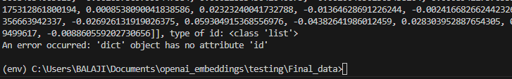

# Interview_tasks

```Asked question:```

Round 1
1. About python slicing 
2. About OOPs concept
3. About django middleware
4. About about mysql
5. About Docker
6. Ask to do resume text extraction and dump the data into mysql 

Round 2
1. Ask to do vector search using the openai and qdrant vector database.
2. I have done the done the two semantic search seperately.
3. I encounter the error while config the qdrant database into openai


Round 3
1. I have done the `system management` code using OOPs concept.
2. Additionally store those data into mysql database.